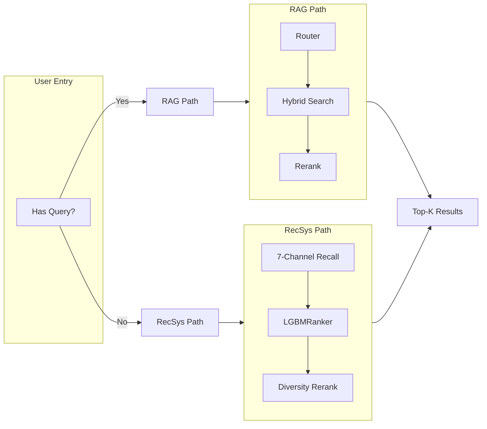

# Intelligent Book Recommendation System

For more details on the architecture, experiments, and design decisions, see the technical report: [Technical Report](docs/architecture/TECHNICAL_REPORT.md).

## Problem

Readers often can't clearly say what they want. Can one system both understand their rough descriptions and give personalized recommendations based on their reading history?

## Method

Two parallel threads: **RAG** (Agentic Router → Hybrid Search → Reranking) for understanding messy queries; **RecSys** (7-channel recall → LGBMRanker → Stacking) for personalized recommendations from reading history.

### Why This Design

- **Hybrid retrieval over pure vectors**: BM25 helps with exact entities (ISBN, author names), while dense embeddings capture semantic similarity; the router chooses the right mix per query.
- **Multi-channel recall**: Using seven recall channels (ItemCF, Swing, Item2Vec, SASRec, popularity, etc.) increases coverage and diversity compared to a single heuristic.
- **Learning-to-rank + stacking**: A LambdaRank-style LGBMRanker consumes features from all channels, and stacking lets a lightweight meta-model learn which signals to trust in different regimes.

## Key Experiments

| Experiment                        | Before                                | After                                                     | Conclusion                                                   |
| :-------------------------------- | :------------------------------------ | :-------------------------------------------------------- | :----------------------------------------------------------- |
| **RAG: Exact match**        | Pure vector search, ISBN → 0% recall | Hybrid (BM25 + Dense) + Router → 100%                    | Vector-only fails on exact entities; BM25 + routing fixes it |
| **RAG: Keyword intent**     | "Harry Potter" → Philosophy book     | Reranked → Sorcerer's Stone                              | Cross-encoder corrects semantic drift                        |
| **RecSys: Personalization** | Baseline 0.138 HR@10                  | Item2Vec + LGBMRanker + Stacking →**0.4545** HR@10 | 7-channel recall + LambdaRank + ensemble beats single model  |

*Evaluation: Leave-Last-Out, n=2000, title-relaxed. HR@10 = 0.4545, MRR@5 = 0.2893.*

### Takeaways

- **Hybrid search > pure vector search** for exact identifiers and queries full of specific names or IDs.
- **Multi-channel recall + LambdaRank** clearly improves HR/MRR over single-model baselines.
- **Reranking** is critical to fix when the model misunderstands what the user actually wants (e.g., turning a vague “Harry Potter” query into the right book).

## Feature Overview

### Core Features

- [X] Semantic search recommendations (RAG: hybrid retrieval + reranking)
- [X] Personalized recommendations (7-channel recall + LGBMRanker)
- [X] User bookshelf and favorites management

### Extended Features

- [X] Chat with Book (LLM chat grounded in book content)
- [X] Personalized marketing copy generation
- [X] Content guardrails for safer outputs

### Experimental Features

- [X] A/B testing framework for recommendation and diversity experiments
- [X] SFT-style data generation pipelines
- [X] LLM-as-a-Judge for evaluating generated content

### Future Ideas

- [ ] Multi-language support
- [ ] Mobile app experience
- [ ] Social sharing and collaborative discovery

## Architecture



**Highlight**: End-to-end system covering RAG routing, multi-channel recall, learning-to-rank ranking, FastAPI backend, React UI, evaluation datasets, and a full technical report.

## Quick Start

```bash
git clone https://github.com/sylvia-ymlin/book-rec-with-LLMs.git
cd book-rec-with-LLMs
conda env create -f environment.yml && conda activate book-rec

# First run (or use make data-pipeline for full build)
python data/scripts/init_db.py     # Chroma vector DB
python scripts/init_sqlite_db.py    # SQLite metadata (local build)

make run                       # API http://localhost:6006
cd web && npm install && npm run dev   # UI http://localhost:5173
```

**LLM**: Choose provider in UI Settings — Ollama (local, default), OpenAI, or Groq. API key required for OpenAI/Groq; stored locally and sent per request.

## License

MIT
