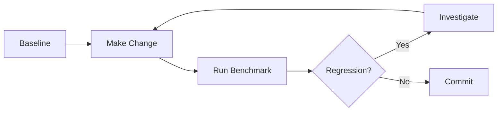

# Benchmarking Guide

**Purpose**: Measure and optimize system performance (latency, throughput, resource usage).
**Last Updated**: 2026-02-12
**Canonical benchmark entrypoint**: `benchmarks/` (component scripts are in `benchmarks/scripts/`).

---

## Table of Contents

1. [Quick Start](#quick-start)
2. [Benchmark Types](#benchmark-types)
3. [Running Benchmarks](#running-benchmarks)
4. [Interpreting Results](#interpreting-results)
5. [Optimization Tips](#optimization-tips)
6. [Regression Testing](#regression-testing)

---

## Quick Start

### Prerequisites

```bash
# Install dependencies
pip install locust  # For load testing

# Ensure API is running
make run
# or: uvicorn src.app.main:app --reload --port 6006
```

### Run All Benchmarks (5 minutes)

```bash
# 1. Component-level benchmarks (vector search, router, etc.)
python benchmarks/scripts/benchmark_retrieval.py
python benchmarks/scripts/benchmark_router.py
python benchmarks/scripts/benchmark_hybrid.py
python benchmarks/scripts/benchmark_rerank.py

# 2. End-to-end benchmark (sequential throughput)
python benchmarks/benchmark.py

# 3. Load test (concurrent users)
locust -f benchmarks/locustfile.py --host=http://localhost:6006
# Open http://localhost:8089 to start test
```

---

## Benchmark Types

### 1. Component Benchmarks (`benchmarks/scripts/`)

**Purpose**: Measure individual components in isolation.

| Script | What It Tests | Typical Latency | When to Run |
|--------|---------------|-----------------|-------------|
| `benchmark_retrieval.py` | VectorDB search (ChromaDB) | 20-100ms | After changing embeddings or index |
| `benchmark_router.py` | Query routing logic | <5ms | After modifying `router.py` |
| `benchmark_hybrid.py` | Hybrid search (BM25 + Dense) | 100-300ms | After tuning RRF alpha |
| `benchmark_rerank.py` | Cross-encoder reranking | 400-800ms | After changing reranker model |
| `benchmark_temporal.py` | Temporal boosting | <10ms | After modifying recency logic |
| `benchmark_compressor.py` | Chat history compression | 200-500ms | After changing context window |

**Example Output**:
```
🚀 Benchmark: Hybrid Search (BM25 + Dense)
━━━━━━━━━━━━━━━━━━━━━━━━━━━━━━━━━━━━━━━━
Query Type    | Mean (ms) | P50 | P95  | P99
━━━━━━━━━━━━━━━━━━━━━━━━━━━━━━━━━━━━━━━━
Semantic      | 287       | 232 | 310  | 450
Keyword       | 145       | 130 | 180  | 220
Exact (ISBN)  | 19        | 15  | 45   | 80
━━━━━━━━━━━━━━━━━━━━━━━━━━━━━━━━━━━━━━━━
```

---

### 2. End-to-End Benchmark (benchmarks/benchmark.py)

**Purpose**: Measure full recommendation pipeline (vector search → ranking → filtering).

**Usage**:
```bash
# Sequential throughput
python benchmarks/benchmark.py

# Concurrent throughput (5 workers)
python benchmarks/benchmark.py --concurrent 5
```

**Metrics**:
- **Latency**: P50, P95, P99 response time
- **Throughput**: Queries per second (QPS)
- **Resource Usage**: Memory, CPU during load

**Example Output**:
```
╔═══════════════════════════════════════════════════════════╗
║           Performance Benchmark Results                   ║
╚═══════════════════════════════════════════════════════════╝

Vector Search (k=50):
  Runs: 50
  Mean: 87.23 ms
  Median: 82.15 ms
  P95: 145.60 ms
  Std Dev: 23.45 ms

Full Recommendation Pipeline:
  Runs: 30
  Mean: 412.50 ms
  Median: 395.20 ms
  P95: 710.30 ms
  Std Dev: 89.10 ms

Sequential Throughput:
  QPS: 2.42 queries/sec

Concurrent Throughput (5 workers):
  QPS: 8.91 queries/sec
  Speedup: 3.68x
```

---

### 3. Load Testing (benchmarks/locustfile.py)

**Purpose**: Simulate real-world traffic with concurrent users.

**Usage**:
```bash
# Start Locust web UI
locust -f benchmarks/locustfile.py --host=http://localhost:6006

# Headless mode (for CI)
locust -f benchmarks/locustfile.py \
  --host=http://localhost:6006 \
  --users 50 \
  --spawn-rate 5 \
  --run-time 2m \
  --headless
```

**Workflow**:
1. Open http://localhost:8089
2. Set number of users (e.g., 50)
3. Set spawn rate (e.g., 5 users/sec)
4. Click "Start swarming"
5. Monitor graphs: RPS, response times, failures

**What It Tests**:
- **Concurrency**: How many simultaneous users can the API handle?
- **Failure Rate**: % of requests that timeout or error
- **Resource Exhaustion**: When does performance degrade?

**Example Results**:
```
Type     Name                    # Requests  # Fails  Avg (ms)  P95 (ms)
-------------------------------------------------------------------------
POST     /recommend              1245        0        423       710
GET      /health                 124         0        12        18
-------------------------------------------------------------------------
         Aggregated              1369        0        402       695

RPS: 11.4 requests/sec
Failures: 0%
```

---

## Running Benchmarks

### Benchmark Workflow



### Step-by-Step

#### 1. Establish Baseline

**Before making changes**, run benchmarks to capture current performance:

```bash
# Component benchmarks
python benchmarks/scripts/benchmark_hybrid.py > baseline_hybrid.txt
python benchmarks/scripts/benchmark_rerank.py > baseline_rerank.txt

# End-to-end
python benchmarks/benchmark.py > baseline_e2e.txt
```

Save these files for comparison.

---

#### 2. Make Your Change

Example: Switching from `all-MiniLM-L6-v2` (384-dim) to `all-mpnet-base-v2` (768-dim).

```python
# src/infra/config.py
- EMBEDDING_MODEL = "sentence-transformers/all-MiniLM-L6-v2"
+ EMBEDDING_MODEL = "sentence-transformers/all-mpnet-base-v2"
```

---

#### 3. Re-run Benchmarks

```bash
# Same benchmarks as baseline
python benchmarks/scripts/benchmark_hybrid.py > new_hybrid.txt
python benchmarks/scripts/benchmark_rerank.py > new_rerank.txt
python benchmarks/benchmark.py > new_e2e.txt
```

---

#### 4. Compare Results

```bash
# Side-by-side comparison (manual)
diff baseline_hybrid.txt new_hybrid.txt

# Or use a script (create scripts/compare_benchmarks.py):
python scripts/compare_benchmarks.py baseline_e2e.txt new_e2e.txt
```

**Example Comparison**:
```
Metric               | Baseline | New    | Change
--------------------------------------------------
Vector Search P50    | 82 ms    | 156 ms | +90% 🔴
Vector Search P95    | 145 ms   | 298 ms | +105% 🔴
Full Pipeline P50    | 395 ms   | 512 ms | +30% ⚠️
Full Pipeline P95    | 710 ms   | 1024 ms| +44% 🔴
```

**Decision**: Latency increased significantly. Check if accuracy improved enough to justify the tradeoff.

---

## Interpreting Results

### Latency Metrics

| Metric | Meaning | Acceptable Range (RAG) | Acceptable Range (RecSys) |
|--------|---------|------------------------|---------------------------|
| **P50** | Median response time | <500ms | <300ms |
| **P95** | 95% of requests complete within | <800ms | <500ms |
| **P99** | 99% of requests complete within | <1500ms | <1000ms |
| **Std Dev** | Consistency (lower = better) | <150ms | <100ms |

**Red Flags**:
- P99 > 2x P50 → High variance, investigate outliers
- Std Dev > Mean → Unstable performance
- Any metric > 3s → User-facing timeout risk

---

### Throughput Metrics

| Metric | Meaning | Target |
|--------|---------|--------|
| **QPS (Sequential)** | Queries per second, single-threaded | Baseline only (not production-relevant) |
| **QPS (Concurrent)** | Queries per second, N workers | >10 QPS for 10 users |
| **Speedup** | Concurrent QPS / Sequential QPS | >0.7N for N workers (70% efficiency) |

**Example**:
- Sequential QPS: 2.5
- Concurrent QPS (10 workers): 15.0
- Speedup: 15.0 / 2.5 = 6.0x
- Efficiency: 6.0 / 10 = 60% (acceptable)

If speedup is <0.5N, likely bottleneck: DB locks, GIL, or I/O contention.

---

### Resource Usage

**Monitor**:
```bash
# CPU & Memory during load test
htop  # or: top

# Python-specific profiling
pip install py-spy
py-spy top --pid $(pgrep -f "uvicorn src.app.main:app")
```

**Acceptable Limits**:
- **CPU**: <80% at peak load (leave headroom for spikes)
- **Memory**: <4GB for 200K books dataset
- **Disk I/O**: <100MB/s (SQLite reads)

---

## Optimization Tips

### Common Bottlenecks

| Symptom | Likely Cause | Fix |
|---------|--------------|-----|
| P95 > 1s for simple queries | Reranking overhead | Disable rerank for FAST strategy |
| High P99/P95 ratio | Cold start | Warm up models on startup |
| Low QPS (<5) under load | DB lock contention | Use read-only connections for SQLite |
| Memory leak (increasing RAM) | Caching without eviction | Add LRU cache with max size |
| High CPU during search | BM25 on full corpus | Use inverted index or FAISS |

---

### Optimization Checklist

**Before Optimizing**:
- [ ] Profile first (`cProfile`, `py-spy`)
- [ ] Establish baseline metrics
- [ ] Identify actual bottleneck (CPU? I/O? Model inference?)

**Quick Wins**:
- [ ] Enable `check_same_thread=False` for SQLite (read-only)
- [ ] Use `torch.inference_mode()` for embeddings
- [ ] Lazy-load models (don't initialize on import)
- [ ] Add caching for expensive operations (embeddings, BM25 index)

**Advanced**:
- [ ] Switch to FAISS for vector search (>1M docs)
- [ ] Use approximate BM25 (top-K pruning)
- [ ] Async I/O for DB queries (SQLite → PostgreSQL)
- [ ] GPU acceleration for embeddings (if available)

---

## Regression Testing

### Continuous Benchmarking (CI/CD)

**Goal**: Catch performance regressions before merge.

**GitHub Actions Example** (`.github/workflows/benchmark.yml`):
```yaml
name: Performance Benchmark

on: [pull_request]

jobs:
  benchmark:
    runs-on: ubuntu-latest
    steps:
      - uses: actions/checkout@v3
      - name: Set up Python
        uses: actions/setup-python@v4
        with:
          python-version: '3.10'
      - name: Install dependencies
        run: pip install -r requirements.txt
      - name: Run benchmark
        run: python benchmarks/benchmark.py > results.txt
      - name: Check regression
        run: |
          # Compare with baseline (stored in repo or artifact)
          python scripts/check_regression.py baseline.txt results.txt
```

---

### Benchmark SLA (Service Level Agreement)

**Define acceptable performance**:

| Endpoint | P95 Latency | P99 Latency | Uptime |
|----------|-------------|-------------|--------|
| `/api/search` (FAST) | <500ms | <800ms | 99.9% |
| `/api/search` (DEEP) | <1000ms | <1500ms | 99.5% |
| `/api/recommend` | <600ms | <1000ms | 99.9% |
| `/health` | <50ms | <100ms | 99.99% |

**Enforcement**:
- Fail CI if any SLA violated
- Generate performance report in PR comment

---

## Reference

### Baseline Performance (v2.6.0)

| Operation | P50 | P95 | P99 |
|-----------|-----|-----|-----|
| **Exact ISBN Search** | 19 ms | 45 ms | 80 ms |
| **Keyword Search (Hybrid)** | 232 ms | 310 ms | 450 ms |
| **Complex Query (Hybrid + Rerank)** | 710 ms | 1250 ms | 1800 ms |
| **RecSys (7-Channel Recall)** | 245 ms | 420 ms | 680 ms |

### Benchmark Scripts Index

| Path | Description |
|------|-------------|
| `benchmarks/benchmark.py` | End-to-end pipeline benchmark |
| `benchmarks/locustfile.py` | Load testing (Locust) |
| `benchmarks/scripts/benchmark_retrieval.py` | VectorDB search latency |
| `benchmarks/scripts/benchmark_router.py` | Router performance |
| `benchmarks/scripts/benchmark_hybrid.py` | Hybrid search (BM25 + Dense) |
| `benchmarks/scripts/benchmark_rerank.py` | Cross-encoder reranking |
| `benchmarks/scripts/benchmark_temporal.py` | Temporal boosting |
| `benchmarks/scripts/api_latency.py` | HTTP API latency (curl-based) |

---

## Getting Help

- **Unexpected slowdown?** Check logs: `tail -f logs/app.log`
- **Memory leak?** Use `memory_profiler`: `python -m memory_profiler benchmark.py`
- **CPU bottleneck?** Use `py-spy`: `py-spy record -o profile.svg -- python benchmark.py`

For deeper investigation, see [performance_debugging_report.md](../docs/performance/performance_debugging_report.md).

---

**Last Updated**: 2026-02-12
**Maintainer**: Performance Engineering Team
