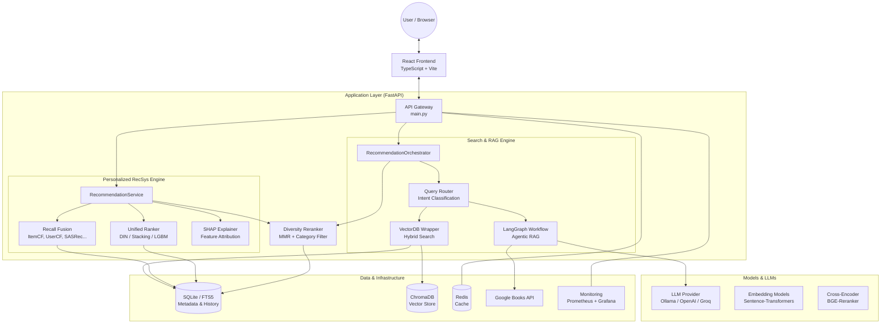

# Project Architecture: Book Recommendation System with LLMs

This document describes the high-level architecture of the system as of April 2026, highlighting the dual-engine approach (RAG vs. RecSys) and the data flow across components.

## High-Level Architecture Diagram

## Component Breakdown

### 1. Dual-Engine Recommendation Logic
The system features two independent pipelines tailored for different user needs:
- **RAG Engine (Knowledge-based)**: Used for intent-driven natural language queries (e.g., "thriller with a twist"). It uses **Hybrid Search** (BM25 + Dense Vector) and can escalate to an **Agentic LangGraph** workflow for complex queries.
- **RecSys Engine (Personalization)**: Used for history-based discovery. It employs a **Multi-channel Recall** strategy (7 algorithms) fused into a **Unified Ranker** (supporting Deep Interest Networks or Gradient Boosting).

### 2. Intelligent Routing
The **Query Router** analyzes incoming requests to determine the best retrieval strategy:
- **Small-to-Big Search**: For general metadata queries.
- **Hybrid Search**: Fusing keyword matches (ISBN/Author) with semantic similarity.
- **Freshness Fallback**: Triggering web search if local data is insufficient.

### 3. Ranking & Diversity
- **Unified Ranking**: A hierarchy of models (DIN > Stacking > LGBM) ensures the best available performance.
- **Shapley Explainability**: Provides transparent reasons for recommendations (e.g., "Recommended because you like Thrillers (+0.15)").
- **MMR Reranking**: Ensures results are not too similar, maximizing catalog exposure and user engagement.

### 4. Data Layer (Zero-RAM Design)
The system is optimized for low memory usage:
- **SQLite + FTS5**: Handles structured metadata lookups and full-text search.
- **ChromaDB**: Manages vector embeddings for semantic search.
- **Redis Cache**: Minimizes latency for frequent queries.

### 5. Monitoring & Ops
A full observability stack is integrated:
- **Prometheus**: Tracks latencies, request counts, and model metrics.
- **Grafana**: Visualizes system health and recommendation KPIs.
- **Alertmanager**: Triggers notifications for system anomalies.
