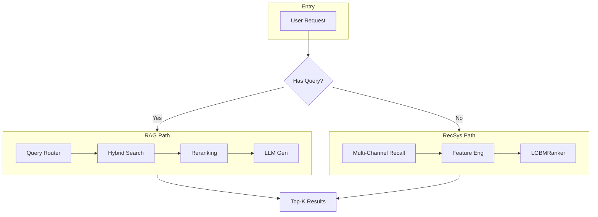

# System Architecture

## Table of Contents

1. [High-Level Overview](#high-level-overview)
2. [Module Dependency Graph](#module-dependency-graph)
3. [Core Components](#core-components)
4. [Data Flow](#data-flow)
5. [File Organization](#file-organization)
6. [Design Patterns](#design-patterns)
7. [Quick Reference](#quick-reference)

---

## High-Level Overview

The system implements a **dual-path recommendation architecture**:



**Key Insight**: Users with explicit queries use RAG (semantic search + LLM); users without queries use collaborative filtering + ranking.

| Block                    | Responsibility                                                                                                  |
| ------------------------ | --------------------------------------------------------------------------------------------------------------- |
| Query Router             | Chooses strategy (EXACT/FAST/DEEP) and whether to rerank based on intent (ISBN, keywords, or natural language). |
| Hybrid Search            | ChromaDB (semantic) + SQLite FTS5 (keyword), merged via RRF.                                                    |
| Reranking                | Cross-Encoder reranks candidates to reduce semantic drift.                                                      |
| Multi-Channel Recall     | 7 channels (ItemCF, SASRec, YoutubeDNN, etc.) fused with RRF.                                                   |
| Feature Eng + LGBMRanker | Feature engineering and LambdaRank-style ranking.                                                               |

---

## Module Dependency Graph

### Layer 1: Entry Points (API)

```
src/main.py (FastAPI app)
    ├── src/api/chat.py     # Chat API (single router)
    └── main.py             # All other endpoints defined inline
```

### Layer 2: Service Orchestration

```
Service Layer
├── src/services/chat_service.py
│   └── Orchestrates RAG pipeline for "Chat with Book"
│
├── src/services/recommend_service.py
│   └── Orchestrates RecSys pipeline (7-channel recall → LGBMRanker)
│
└── src/services/personal_recommend_handler.py
    └── Handles /api/recommend/personal (params, cold-start intent probing, enrichment)
```

### Layer 3: Core Logic (RAG Path)

```
Layer 3: Core Logic (RAG Path)
RAG Pipeline
├── src/core/router.py (QueryRouter)
│   ├── Classifies query intent (EXACT/FAST/DEEP)
│   └── Routes to appropriate retrieval strategy
│
├── src/vector_db.py (VectorDB - Singleton)
│   ├── ChromaDB for dense retrieval
│   ├── SQLite FTS5 for sparse retrieval
│   ├── Hybrid Search (RRF fusion)
│   └── Small-to-Big retrieval (sentence → book)
│
├── src/core/reranker.py (Reranker)
│   └── Cross-encoder (ms-marco-MiniLM) for top-K precision
│
├── src/core/temporal.py (TemporalRanker)
│   └── Recency boosting for "latest/new" queries
│
├── src/core/diversity_reranker.py (optional)
│   └── MMR + category constraint when ENABLE_RAG_DIVERSITY
│
└── src/core/llm.py (LLMFactory)
    └── OpenAI / Ollama / Groq integration for generation
```

### Layer 4: Core Logic (RecSys Path)

```
RecSys Pipeline
├── src/recall/fusion.py (RecallFusion)
│   ├── Coordinates 7 recall channels via RRF
│   └── Channels:
│       ├── src/recall/itemcf.py (ItemCF - direction-weighted)
│       ├── src/recall/usercf.py (UserCF - user-user co-occurrence)
│       ├── src/recall/swing.py (Swing - user-pair overlap)
│       ├── src/recall/sasrec_recall.py (SASRec - Transformer)
│       ├── src/recall/item2vec.py (Item2Vec - Word2Vec)
│       ├── src/recall/embedding.py (YoutubeDNN - Two-tower)
│       └── src/recall/popularity.py (Popularity - cold-start)
│
├── src/ranking/features.py (FeatureEngineer)
│   └── 17 ranking features (user stats, CF scores, SASRec scores)
│
├── LGBMRanker (lgbm_ranker.txt, loaded in recommend_service.py)
│   └── LambdaRank optimization for NDCG
│
├── src/ranking/din.py (DINRanker - optional)
│   └── Deep Interest Network for sequence modeling
│
└── src/core/diversity_reranker.py (DiversityReranker)
    └── MMR + category constraints for diverse results
```

### Layer 5: Data Access

```
Data Layer
├── src/core/metadata_store.py (MetadataStore)
│   ├── SQLite (books.db) for book metadata (Zero-RAM mode)
│   └── FTS5 (books_fts) for full-text search
│
├── src/core/online_books_store.py (OnlineBooksStore - Singleton)
│   └── SQLite (online_books.db) for web-discovered books (freshness_fallback)
│
├── src/user/profile_store.py (module)
│   └── JSON (user_profiles.json) for user favorites and reading history
│
└── src/data/repository.py (DataRepository - Singleton)
    └── Unified interface: metadata (MetadataStore) + user interaction history (recall_models.db)
```

### Supporting Modules

```
Utilities & Extensions
├── src/core/context_compressor.py
│   └── Chat history compression (LLM summarization)
│
├── src/core/freshness_monitor.py
│   └── Detects when local data is stale (used to trigger web search)
│
├── src/core/web_search.py
│   └── Google Books API fallback for missing/fresh books
│
├── src/marketing/persona.py
│   └── User persona generation for chat context
│
└── src/config.py
    └── Global configuration (pydantic-settings, paths, hyperparameters)
```

---

## Core Components

### 1. QueryRouter (`src/core/router.py`)

**Responsibility**: Intent classification for RAG queries.

**Strategies**:

- **EXACT**: ISBN/exact match → BM25 only (no reranking)
- **FAST**: 1-2 keywords → Hybrid search (no reranking)
- **DEEP**: Complex queries → Hybrid + Cross-encoder reranking

**Key Logic**:

```python
if re.match(r"^\d{10,13}$", query):
    return "EXACT"
elif len(words) <= 2:
    return "FAST"
else:
    return "DEEP"
```

**Dependencies**:

- `src/core/intent_classifier.py` (optional ML classifier)
- `config/router.json` (detail keywords: "twist", "ending", etc.)

---

### 2. VectorDB (`src/vector_db.py`)

**Responsibility**: Hybrid retrieval (BM25 + Dense embeddings).

**Components**:

- **ChromaDB**: Dense retrieval (all-MiniLM-L6-v2, 384-dim)
- **BM25Okapi**: Sparse retrieval for exact/keyword matches
- **RRF**: Reciprocal Rank Fusion for merging results

**Key Method**:

```python
def hybrid_search(query, k=10, alpha=0.5):
    dense_results = chroma.search(query, k=50)
    sparse_results = bm25.get_top_n(query, k=50)
    merged = rrf_fusion(dense_results, sparse_results, alpha)
    return merged[:k]
```

**Dependencies**:

- `rank_bm25` library
- `chromadb` library
- `sentence-transformers`

---

### 3. RecallFusion (`src/recall/fusion.py`)

**Responsibility**: Multi-channel recall aggregation.

**Algorithm**: Reciprocal Rank Fusion (RRF)

```python
for rank, (item, score) in enumerate(channel_results):
    rrf_score = weight * (1.0 / (k + rank + 1))
    candidates[item] += rrf_score
```

**Channels** (configurable):

- ItemCF (weight=1.0) — co-occurrence with direction weight
- SASRec (weight=1.0) — sequential Transformer
- YoutubeDNN (weight=1.0) — two-tower neural
- Item2Vec (weight=0.8) — Word2Vec on sequences
- UserCF (weight=1.0) — Jaccard similarity
- Swing (weight=1.0) — user-pair overlap weighting
- Popularity (weight=0.5) — cold-start fallback

**Dependencies**: All recall modules in `src/recall/`

---

### 4. FeatureEngineer (`src/ranking/features.py`)

**Responsibility**: Generate 17 ranking features from recall candidates.

**Feature Groups**:

1. **User Stats**: `u_cnt`, `u_mean`, `u_std`
2. **Item Stats**: `i_cnt`, `i_mean`, `i_std`
3. **Cross Features**: `len_diff`, `u_auth_avg`, `u_auth_match`, `is_cat_hob`
4. **Sequence**: `sasrec_score`, `sim_max`, `sim_min`, `sim_mean`
5. **CF Scores**: `icf_sum`, `icf_max`, `ucf_sum`

**Dependencies**:

- Recall models for CF scores
- SASRec embeddings
- `data/rec/train.csv` for statistics

---

### 5. MetadataStore (`src/core/metadata_store.py`)

**Responsibility**: Zero-RAM book metadata lookup.

**Implementation**:

- SQLite with FTS5 index
- Lazy connection (opens on first query)
- Singleton pattern for global access

**Key Methods**:

```python
def get_book_metadata(isbn: str) -> dict
def search_books_fts(query: str) -> List[dict]
def get_books_batch(isbns: List[str]) -> List[dict]
```

**Dependencies**:

- `data/books.db` (main store)
- `data/online_books.db` (staging store for API fetches)

---

## Data Flow

### RAG Flow (User Query → LLM Response)

```
1. User Query → QueryRouter
   └─ Classify intent: EXACT / FAST / DEEP

2. VectorDB.hybrid_search()
   ├─ BM25 sparse search (k=50)
   ├─ Chroma dense search (k=50)
   └─ RRF fusion → Top-50 candidates

3. [Optional] Reranker.rerank() (DEEP only)
   └─ Cross-encoder scoring → Top-10

4. [Optional] TemporalBooster.boost() (if "new"/"latest" detected)
   └─ Recency scoring

5. MetadataStore.get_books_batch()
   └─ Enrich with full metadata

6. LLM Generation (streaming)
   └─ SSE response to frontend
```

### RecSys Flow (User → Personalized Recommendations)

```
1. RecallFusion.get_recall_items(user_id)
   ├─ ItemCF.recommend() → RRF
   ├─ SASRec.recommend() → RRF
   ├─ YoutubeDNN.recommend() → RRF
   ├─ Popularity.recommend() → RRF
   └─ Merge → Top-100 candidates

2. FeatureEngineer.extract_features(user_id, candidates)
   └─ 17 features per candidate

3. LGBMRanker.predict(features)
   └─ Ranking scores

4. DiversityReranker.rerank() [P0]
   ├─ MMR for diversity (λ=0.75)
   ├─ Popularity penalty (γ=0.3)
   └─ Max 3 per category in top-10

5. MetadataStore.get_books_batch()
   └─ Return enriched results
```

---

## File Organization

```
src/
├── main.py                    # FastAPI app entry point (669 lines)
├── config.py                  # Global configuration
├── utils.py                   # Logging, helpers
│
├── api/                       # REST API endpoints
│   └── chat.py
│
├── services/                  # Business logic orchestration
│   ├── chat_service.py        # RAG pipeline (157 lines)
│   └── recommend_service.py   # RecSys pipeline (313 lines)
│
├── core/                      # Domain logic
│   ├── router.py              # Query intent classification (177 lines)
│   ├── reranker.py            # Cross-encoder reranking
│   ├── temporal.py            # Recency boosting
│   ├── llm.py                 # LLM factory (OpenAI/Ollama)
│   ├── metadata_store.py      # SQLite metadata access (288 lines)
│   ├── diversity_reranker.py  # MMR diversity (204 lines)
│   ├── context_compressor.py  # Chat history compression
│   ├── freshness_monitor.py   # Staleness detection (231 lines)
│   ├── web_search.py          # Google Books API (427 lines)
│   └── online_books_store.py  # Staging DB (220 lines)
│
├── vector_db.py               # Hybrid search (368 lines)
│
├── recall/                    # Recall channels
│   ├── fusion.py              # RRF fusion (173 lines)
│   ├── itemcf.py              # Item CF (221 lines)
│   ├── usercf.py              # User CF (150 lines)
│   ├── swing.py               # Swing (163 lines)
│   ├── sasrec_recall.py       # SASRec (337 lines)
│   ├── item2vec.py            # Item2Vec (122 lines)
│   ├── embedding.py           # YoutubeDNN (333 lines)
│   └── popularity.py          # Popularity (59 lines)
│
├── ranking/                   # Ranking stage
│   ├── features.py            # Feature engineering (470 lines)
│   ├── din.py                 # DIN ranker (220 lines)
│   └── explainer.py           # SHAP explainability
│
├── data/                      # Data access layer
│   └── repository.py          # Unified data interface
│
├── user/                      # User management
│   └── profile_store.py       # User profiles (246 lines)
│
└── model/                     # Model training
    └── sasrec.py              # SASRec PyTorch model
```

---

## Design Patterns

### 1. Singleton Pattern

**Where**: `VectorDB`, `MetadataStore`, `ChatService`

**Why**:

- Share heavy resources (embeddings, DB connections)
- Avoid reloading models on each request

**Example**:

```python
class VectorDB:
    _instance = None

    def __new__(cls):
        if cls._instance is None:
            cls._instance = super().__new__(cls)
        return cls._instance
```

---

### 2. Repository Pattern

**Where**: `DataRepository` (`src/data/repository.py`)

**Why**:

- Abstract data access (SQLite, ChromaDB, profile store)
- Single source of truth for book metadata

**Example**:

```python
class DataRepository:
    def get_book_metadata(self, isbn: str) -> dict:
        # Check main store → online store → return None
        return metadata_store.get_book_metadata(isbn)
```

---

### 3. Strategy Pattern

**Where**: `QueryRouter` (RAG strategies), `RecallFusion` (channel selection)

**Why**:

- Different retrieval strategies based on query type
- Configurable channel weights

**Example**:

```python
class QueryRouter:
    def route(self, query: str) -> dict:
        if self._is_isbn(query):
            return {"strategy": "EXACT", "alpha": 1.0, "rerank": False}
        elif self._is_keyword(query):
            return {"strategy": "FAST", "alpha": 0.5, "rerank": False}
        else:
            return {"strategy": "DEEP", "alpha": 0.3, "rerank": True}
```

---

### 4. Factory Pattern

**Where**: `LLMFactory` (`src/core/llm.py`)

**Why**:

- Support multiple LLM providers (OpenAI, Ollama)
- Runtime provider selection via API key

**Example**:

```python
class LLMFactory:
    @staticmethod
    def create(provider: str, **kwargs):
        if provider == "openai":
            return ChatOpenAI(**kwargs)
        elif provider == "ollama":
            return ChatOllama(**kwargs)
```

---

### 5. Lazy Loading

**Where**: Recall models, rankers, embeddings

**Why**:

- Reduce startup time
- Load only when first request comes in

**Example**:

```python
class RecallFusion:
    def load_models(self):
        if self.models_loaded:
            return
        # Load all recall models
        self.models_loaded = True
```

---

### Key Configuration Files

| File               | Purpose                                                               |
| ------------------ | --------------------------------------------------------------------- |
| src/config.py      | App config (pydantic-settings, paths, hyperparameters, env overrides) |
| config/router.json | Router keywords (detail, freshness, natural-language queries)         |
| requirements.txt   | Pip dependencies (single source of truth)                             |
| environment.yml    | Conda env (installs from requirements.txt)                            |
| Makefile           | Common commands (make run, make test)                                 |
| Dockerfile         | Production deployment                                                 |

---

### Common Workflows

**Start API Server**:

```bash
make run
# or: uvicorn src.main:app --reload --port 6006
```

**Run Tests**:

```bash
make test
# or: pytest tests/
```

**Rebuild Data Pipeline**:

```bash
make data-pipeline
# or: python scripts/run_pipeline.py
```

**Train Recall Models**:

```bash
python scripts/model/build_recall_models.py
```

**Evaluate RecSys**:

```bash
python scripts/model/evaluate.py
```
