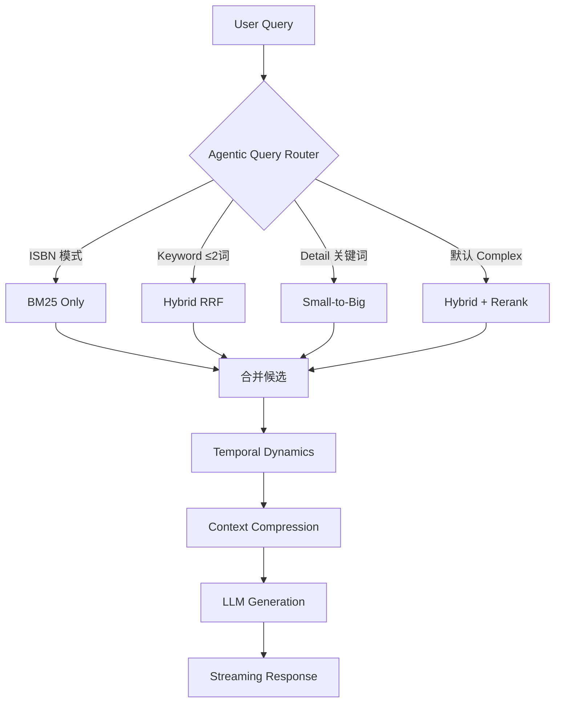
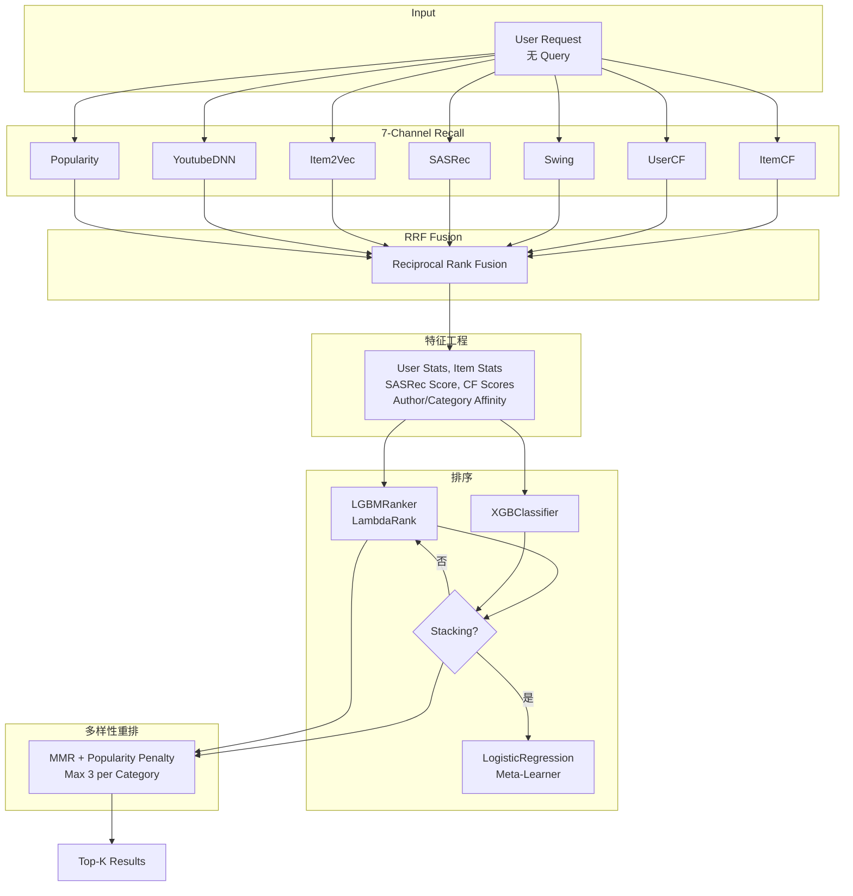
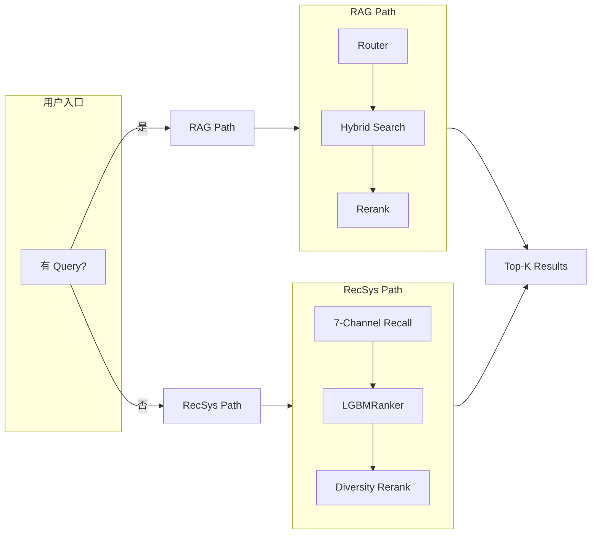
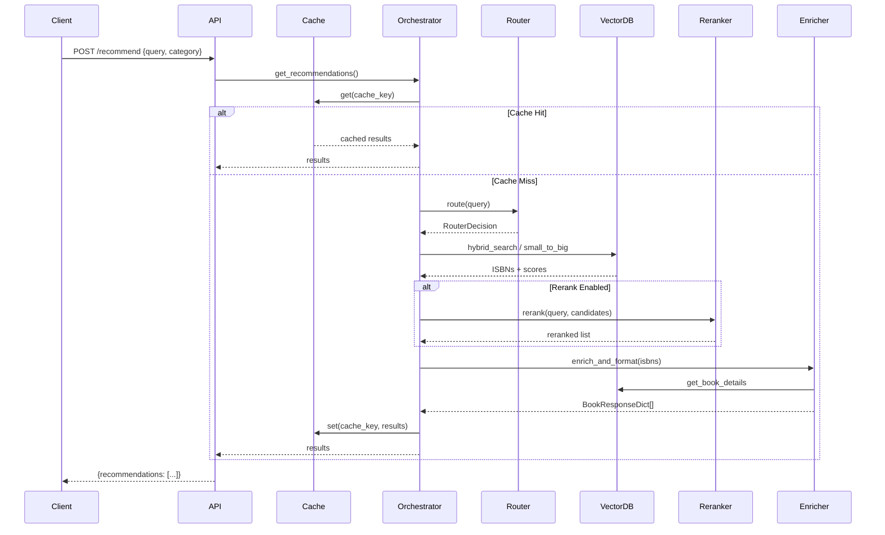
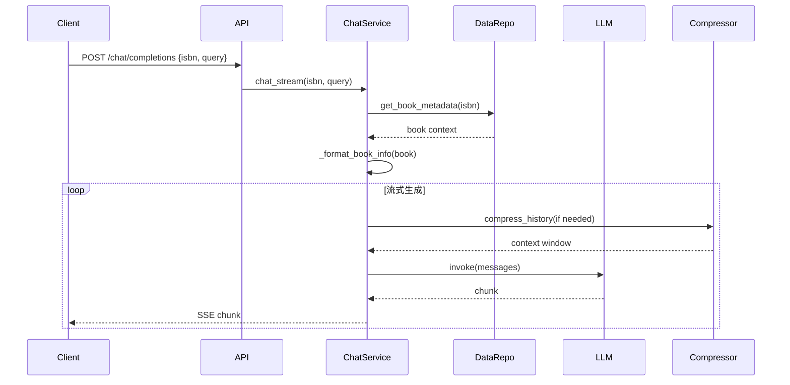
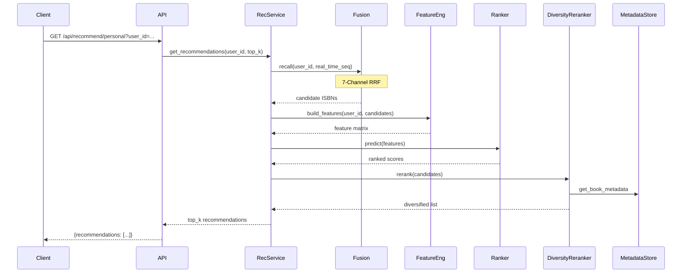
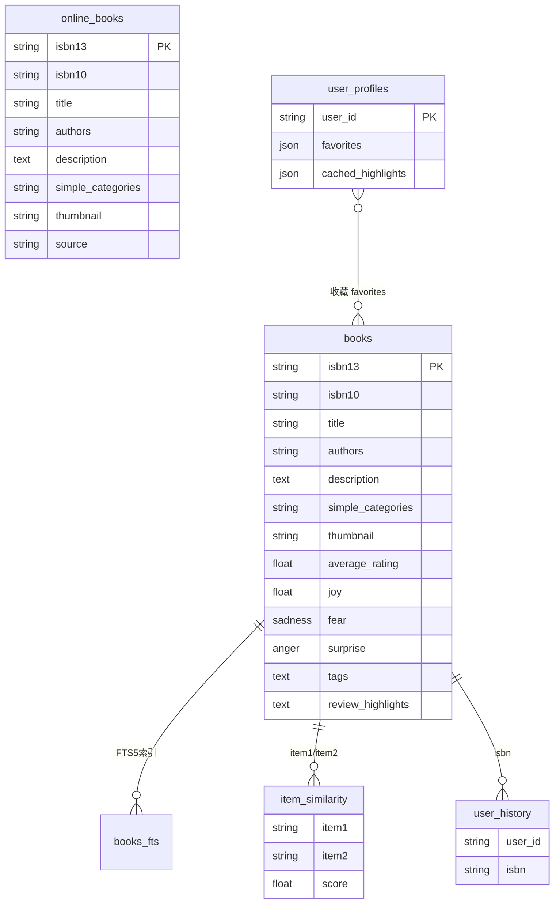
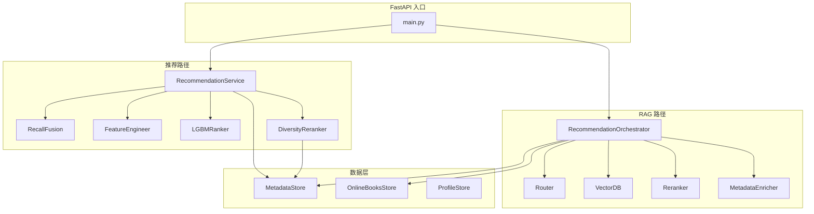

# 架构图可视化

本文档补充 [TECHNICAL_REPORT.md](TECHNICAL_REPORT.md) 中的 ASCII 架构图，提供可渲染的流程图、时序图和 ER 图。使用 [Mermaid](https://mermaid.js.org/) 语法，可在 GitHub、GitLab、VS Code 等环境中直接渲染。

---

## 1. 流程图 (Flowcharts)

### 1.1 RAG 检索流水线



### 1.2 个性化推荐流水线



### 1.3 双路径决策流程



---

## 2. 时序图 (Sequence Diagrams)

### 2.1 RAG 推荐接口 (`POST /recommend`)



### 2.2 聊天接口 (`POST /chat/completions`)



### 2.3 个性化推荐接口 (`GET /api/recommend/personal`)



---

## 3. ER 图 (Entity Relationship Diagram)



### 数据存储说明

| 存储 | 路径 | 用途 |
|------|------|------|
| `books` | `data/books.db` | 主元数据，只读 |
| `books_fts` | `data/books.db` | FTS5 全文搜索 |
| `online_books` | `data/online_books.db` |  freshness_fallback 写入 |
| `user_profiles` | `data/user_profiles.json` | 用户收藏、评分、状态 |
| `item_similarity` | recall SQLite | ItemCF 相似度矩阵 |
| `user_history` | recall SQLite | 用户历史（召回用） |
| ChromaDB | `data/chroma_db` | 向量检索（Dense） |
| ChromaDB Chunks | `data/chroma_chunks` | Small-to-Big 句子级索引 |

---

## 4. 组件依赖图



---

## 渲染说明

- **GitHub / GitLab**: 默认支持 Mermaid，直接显示
- **VS Code**: 安装 "Markdown Preview Mermaid Support" 扩展
- **命令行**: 使用 `mmdc` (mermaid-cli) 导出 PNG/SVG
  ```bash
  npm install -g @mermaid-js/mermaid-cli
  mmdc -i docs/architecture/ARCHITECTURE_DIAGRAMS.md -o docs/diagrams/
  ```
