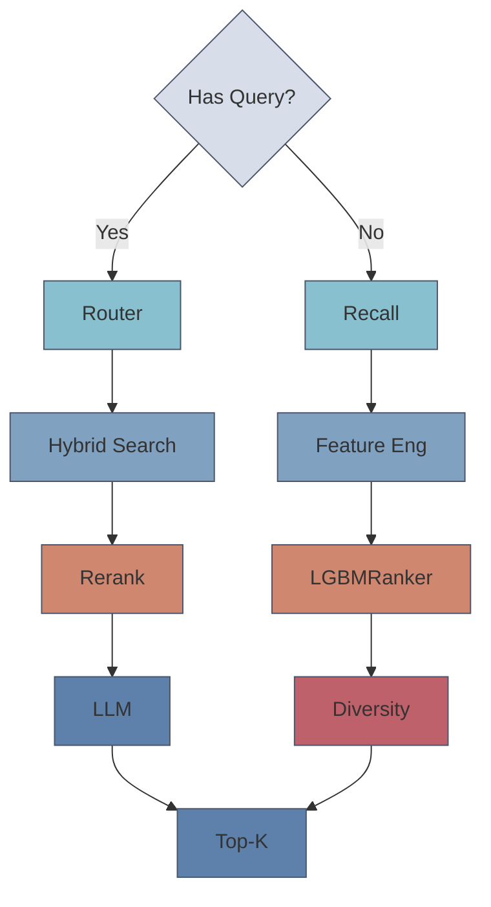

# Onboarding Guide

## Table of Contents

1. [Project Overview](#project-overview-5-min)
2. [Setup &amp; Installation](#setup--installation-10-15-min)
3. [System Tour](#system-tour-15-min)
4. [Running Your First Query](#running-your-first-query-5-min)
5. [Code Navigation Guide](#code-navigation-guide-10-min)

---

## Project Overview

### What Does This System Do?

An intelligent book recommendation system that combines semantic search (RAG) with collaborative filtering (RecSys).

### Two Core Paths



### Key Metrics

- **RecSys**: HR@10 = 0.4545, MRR@5 = 0.2893
- **RAG**: 100% recall on ISBN exact match; P95 &lt;800ms for DEEP-intent queries (natural language → Hybrid + Rerank)
- **Dataset**: 222K books, 168K users, 2.7M interactions

---

## Setup & Installation

### Prerequisites

- **Conda** (Miniconda or Anaconda)
- **Git**
- **8GB RAM minimum** (16GB recommended for full data pipeline)

### Setup

```bash
# 1. Clone the repository
git clone https://github.com/sylvia-ymlin/book-rec-with-LLMs.git
cd book-rec-with-LLMs

# 2. Create environment
conda env create -f environment.yml
conda activate book-rec

# 3. Initialize databases (first-time setup)
python src/init_db.py                  # Vector DB (ChromaDB)
python scripts/init_sqlite_db.py       # Metadata DB (SQLite)

# 4. Start API server
make run
# or: uvicorn src.main:app --reload --port 6006
```

### Quick Verification

```bash
# Test 1: API server is running
curl http://localhost:6006/health
# Expected: {"status": "healthy"}

# Test 2: Run tests
make test
# or: pytest tests/

# Test 3: Check vector DB
python -c "from src.vector_db import VectorDB; db = VectorDB(); print('VectorDB OK')"
```

**Frontend** (Optional):

```bash
cd web
npm install
npm run dev
# Open http://localhost:5173
```

---

## System Tour

### File Structure

```
book-rec-with-LLMs/
├── src/                    # Core application code
│   ├── main.py            # FastAPI app (START HERE)
│   ├── api/               # Chat API
│   ├── agentic/           # RAG agent (router, retrieve, evaluate)
│   ├── services/          # Business logic (chat, recommendations)
│   ├── core/              # RAG components (router, reranker, etc.)
│   ├── recall/            # 7 recall channels (ItemCF, SASRec, etc.)
│   ├── ranking/           # Feature engineering, LGBMRanker
│   ├── marketing/         # Highlights, personas, guardrails
│   └── vector_db.py       # Hybrid search (BM25 + ChromaDB)
│
├── data/                   # Generated at runtime (not in git)
│   ├── books.db           # SQLite metadata (init_sqlite_db.py)
│   ├── chroma_db/         # Vector embeddings (init_db.py)
│   ├── rec/               # RecSys train/val/test splits
│   └── model/             # Trained models (ItemCF, SASRec, ranker)
│
├── config/                # Router keywords, data config
├── scripts/               # Data pipeline & model training
│   ├── run_pipeline.py    # Master pipeline script
│   ├── init_sqlite_db.py  # Create SQLite metadata DB
│   ├── data/              # Data preprocessing
│   └── model/             # Model training scripts
│
├── benchmarks/            # Latency & load testing
├── tests/                 # Unit & integration tests
├── docs/                  # Documentation (YOU ARE HERE)
└── web/                   # React frontend
```

### Key Entry Points

| File                                  | What It Does                  | When to Read It               |
| ------------------------------------- | ----------------------------- | ----------------------------- |
| `src/main.py`                       | FastAPI app, API endpoints    | Understanding API structure   |
| `src/services/chat_service.py`      | RAG pipeline orchestration    | Adding RAG features           |
| `src/services/recommend_service.py` | RecSys pipeline orchestration | Adding RecSys features        |
| `src/core/router.py`                | Query intent classification   | Modifying RAG routing logic   |
| `src/recall/fusion.py`              | Multi-channel recall fusion   | Understanding recall strategy |
| `src/vector_db.py`                  | Hybrid search implementation  | Debugging search issues       |

### Data Flow Diagrams

See **[ARCHITECTURE.md](ARCHITECTURE.md)** for detailed diagrams. Quick summary:

**RAG Flow**:

```
Query → Router → VectorDB.hybrid_search() → Reranker → LLM → Response
```

**RecSys Flow**:

```
UserID → RecallFusion (7 channels) → FeatureEngineer → LGBMRanker → Results
```

---

## Running Your First Query

### Test RAG (Semantic Search)

```bash
# Make sure API is running (make run)

# Simple keyword search
curl -X POST http://localhost:6006/api/search \
  -H "Content-Type: application/json" \
  -d '{"query": "Harry Potter", "k": 5}'

# Complex semantic query
curl -X POST http://localhost:6006/api/search \
  -H "Content-Type: application/json" \
  -d '{"query": "philosophical novels about the meaning of life", "k": 10}'

# ISBN exact match
curl -X POST http://localhost:6006/api/search \
  -H "Content-Type: application/json" \
  -d '{"query": "0060959479", "k": 1}'
```

### Test RecSys (Personalized Recommendations)

```bash
# Get recommendations for a user
curl -X POST http://localhost:6006/api/recommend \
  -H "Content-Type: application/json" \
  -d '{"user_id": "A3SPTOKDG7WBLN", "k": 10}'
```

**Interactive Testing** (Python):

```python
from src.vector_db import VectorDB
from src.core.router import QueryRouter

# Initialize
db = VectorDB()
router = QueryRouter()

# Test routing
strategy = router.route("Find me books about AI")
print(f"Strategy: {strategy}")  # Should be "DEEP"

# Test search
results = db.hybrid_search("science fiction about AI", k=5)
for doc in results:
    print(f"- {doc.metadata.get('title', 'Unknown')}")
```

---

## Design Patterns

| Pattern              | Where                                            | Why                                                |
| -------------------- | ------------------------------------------------ | -------------------------------------------------- |
| **Singleton**  | `VectorDB`, `MetadataStore`, `ChatService` | Share heavy resources (embeddings, DB connections) |
| **Repository** | `DataRepository`                               | Abstract data access from multiple sources         |
| **Strategy**   | `QueryRouter`                                  | Different retrieval strategies based on intent     |
| **Factory**    | `LLMFactory`                                   | Support multiple LLM providers (OpenAI, Ollama)    |

## Data Pipeline

```bash
# Full rebuild (takes 1-2 hours)
make data-pipeline

# Rebuild just RecSys data
python scripts/data/split_rec_data.py

# Train recall models (ItemCF, SASRec, etc.)
python scripts/model/build_recall_models.py

# Train ranking model
python scripts/model/train_ranker.py

# Evaluate RecSys
python scripts/model/evaluate.py
```

### Development

```bash
# Run API server (auto-reload)
make run

# Run tests
make test

# Run specific test
pytest tests/test_vector_db.py -v

# Lint code
make lint

# Clean cache
make clean
```

### Benchmarking

```bash
# Benchmark hybrid search latency
python scripts/benchmark/benchmark_hybrid.py

# Benchmark router performance
python scripts/benchmark/benchmark_router.py

# Load test API
locust -f benchmarks/locustfile.py
```

### Docker

```bash
# Build image
make docker-build

# Run container
make docker-up

# Or with docker-compose
docker-compose up
```
